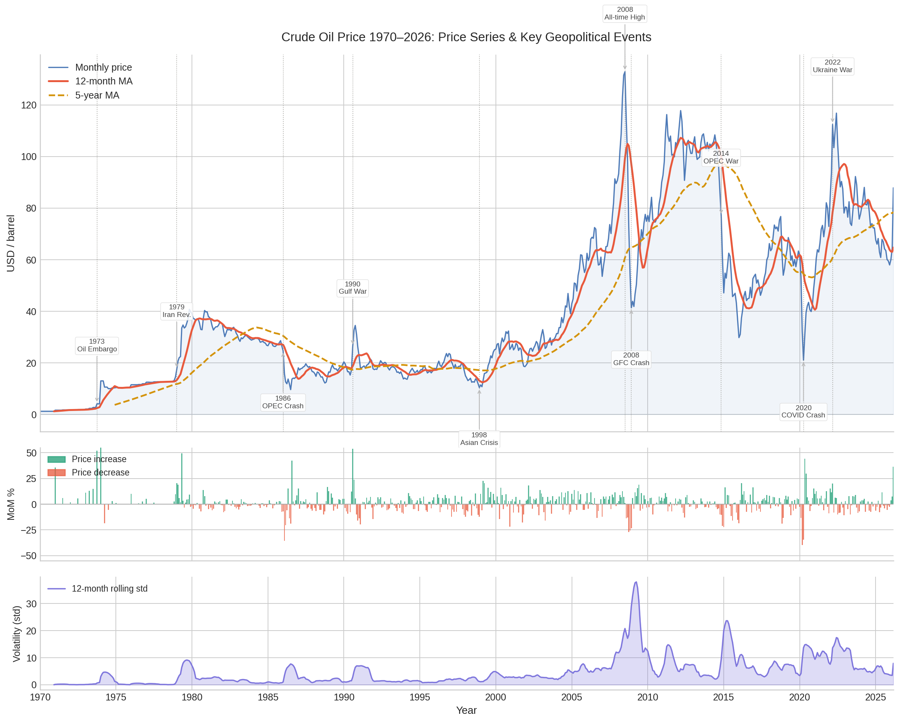

<div align="center"> 

# 🛢️ WTI Oil Price Analysis & Forecasting (1970-2026)

**An end to end data science project analysing 56 years of WTI crude oil prices- covering EDA, geopolitical event quantification, structural break detection and ARIMA, Prophet & LSTM forecasting deployed as a live interactive Streamlit dashboard.**

<p align="center">

<a href="https://musaislamfahad-oil-dashboard.streamlit.app">
  
</a>


</p>


</div>

---

## 🔴 Live Dashboard

**[→ Launch the Interactive Dashboard](https://musaislamfahad-oil-dashboard.streamlit.app)**

[](https://musaislamfahad-oil-dashboard.streamlit.app)

> _Click the image to open the live dashboard - 5 tabs: Price History, Event Analysis, Forecasts, Model Comparison, and Data Explorer_

---

## 📖 Overview

Crude oil is the single most politically sensitive commodity on earth. Its price has been shaped by wars, revolutions, financial crises, and pandemics yet most analyses treat it as a pure statistical series and ignore that context.

This project takes a different approach: **quantify the geopolitical shocks first, then build forecasting models that encode that domain knowledge.** The result is a four-notebook pipeline that demonstrates the complete data science workflow from raw CSV to deployed dashboard while producing insights that a purely statistical treatment would miss.

---

## 📓 Open the Notebooks

| # | Notebook | What It Covers | Open in Colab |
|---|----------|---------------|---------------|
| 00 | `00_project_setup.ipynb` | Drive mount, folder structure, library install, data cleaning & feature engineering | [](https://colab.research.google.com/github/MusaIslamFahad/Crude_Oil_Price_Analysis_and_Forecasting-1970-2026-/blob/main/00_project_setup.ipynb) |
| 01 | `01_eda.ipynb` | 11-section EDA: hero chart, distributions, decade breakdown, decomposition, stationarity, ACF/PACF, volatility clustering | [](https://colab.research.google.com/github/MusaIslamFahad/Crude_Oil_Price_Analysis_and_Forecasting-1970-2026-/blob/main/01_eda.ipynb) |
| 02 | `02_event_analysis.ipynb` | Event study (-12 to +24M windows), impact metrics, Pelt structural break detection, regime classification, Mann-Whitney comparison | [](https://colab.research.google.com/github/MusaIslamFahad/Crude_Oil_Price_Analysis_and_Forecasting-1970-2026-/blob/main/02_event_analysis.ipynb) |
| 03 | `03_forecasting.ipynb` | ARIMA(2,1,1), Prophet with custom changepoints, LSTM- walk-forward validation, model comparison, 12-month forward forecast | [](https://colab.research.google.com/github/MusaIslamFahad/Crude_Oil_Price_Analysis_and_Forecasting-1970-2026-/blob/main/03_forecasting.ipynb) |

---

## 📊 Key Findings

| Finding | Detail |
|---------|--------|
| **Fastest price spike** | 1973 Arab Oil Embargo: prices rose **+217% in 3 months** with a 3-month abnormal return of **+212%** |
| **Worst single crash** | 2008 Global Financial Crisis: **−58.5% in 3 months**, 3-month abnormal return of **−56.7%** |
| **Slowest recovery** | 1986 OPEC Collapse & 2014 Price War: neither recovered to baseline within the 24-month event window |
| **Highest ever price** | **$132.83/barrel**: July 2008 Pre-Crisis Peak |
| **Lowest ever price** | **$1.21/barrel**: January–April 1970 |
| **Seasonal signal** | Weak: seasonal component explains **< 5%** of variance in multiplicative decomposition |
| **Stationarity** | Price is **I(1)**: requires one round of differencing; log returns are stationary (ADF confirmed) |
| **Structural regimes** | Pelt algorithm detects **3 distinct price regimes** with breakpoints at **Dec 1978** and **Sep 2004** |
| **Best forecast model** | **ARIMA wins**: RMSE 5.75, MAPE 5.28% vs LSTM (RMSE 6.74) vs Prophet (RMSE 22.18) |

---

## 🌍 Geopolitical Events - Real Impact Metrics

| Year | Event | Type | Direction | Change from Shock | 3M Abnormal Return | Recovery |
|------|-------|------|-----------|-----------------|-------------------|---------|
| 1973 | Arab Oil Embargo | Supply shock | 📈 Spike | +217.1% | +212.1% | Not in 24M window |
| 1979 | Iranian Revolution | Supply shock | 📈 Spike | +133.5% | +24.2% | Not in 24M window |
| 1986 | OPEC Price Collapse | Supply shock | 📉 Crash | -61.0% | -51.3% | Not in 24M window |
| 1990 | Gulf War | Supply shock | 📈 Spike | +30.7% | +16.2% | 6 months |
| 1998 | Asian Financial Crisis | Demand shock | 📉 Crash | -30.6% | -7.4% | 18 months |
| 2008 | Pre-Crisis Peak | Demand shock | 📈 Spike | +40.8% from baseline | -54.2% | 2 months |
| 2008 | Global Financial Crisis | Financial crisis | 📉 Crash | -58.5% | -56.7% | Not in 24M window |
| 2014 | OPEC Price War | Supply shock | 📉 Crash | -61.3% | -22.4% | Not in 24M window |
| 2020 | COVID-19 Crash | Demand shock | 📉 Crash | -34.7% | +26.3% | 11 months |
| 2022 | Russia-Ukraine War | Supply shock | 📈 Spike | +24.9% | +16.5% | 10 months |

---

## 📉 Structural Regimes

The Pelt algorithm (Bai-Perron via `ruptures`) detected **2 breakpoints** in the price series, creating **3 labelled market regimes**:

| Regime | Period | Description |
|--------|--------|-------------|
| **Pre-embargo era** | Jan 1970 - Nov 1978 | Stable, low-price environment before the first OPEC shock |
| **Oil shock era** | Dec 1978 - Aug 2004 | High volatility, multiple supply shocks and political crises |
| **OPEC overproduction** | Sep 2004 - Mar 2026 | Commodity supercycle, GFC crash, shale revolution, COVID |

---

## 📈 Model Results (24-Month Test Set)

### Evaluation Metrics

| Rank | Model | RMSE | MAE | MAPE |
|------|-------|------|-----|------|
| 🥇 1 | **ARIMA (2,1,1) - walk-forward** | **5.75** | **3.88** | **5.28%** |
| 🥈 2 | LSTM - walk-forward | 6.74 | 4.66 | 6.40% |
| 🥉 3 | Prophet - custom changepoints | 22.18 | 17.73 | 26.54% |

> **Why ARIMA wins:** On a 24-month horizon the mean-reverting structure of oil prices favours a well specified ARIMA. Prophet's wide RMSE reflects difficulty fitting the sharp post-2020 recovery without overfitting changepoints. LSTM outperforms Prophet but cannot beat ARIMA on this horizon, consistent with the general finding that deep learning requires longer sequences to justify its complexity.

### 12-Month Forward Forecast (Apr 2026 - Mar 2027)

| Month | ARIMA ($/bbl) | LSTM ($/bbl) | Prophet ($/bbl) |
|-------|--------------|-------------|----------------|
| Apr 2026 | 96.53 | 76.24 | 76.52 |
| May 2026 | 98.94 | 82.59 | 88.15 |
| Jun 2026 | 98.77 | 84.91 | 72.78 |
| Jul 2026 | 97.64 | 84.65 | 82.22 |
| Aug 2026 | 96.23 | 82.67 | 77.62 |
| Sep 2026 | 94.83 | 80.00 | 59.43 |
| Oct 2026 | 93.54 | 77.67 | 68.85 |
| Nov 2026 | 92.40 | 76.39 | 65.80 |
| Dec 2026 | 91.40 | 76.34 | 58.43 |
| Jan 2027 | 90.54 | 77.29 | 54.41 |
| Feb 2027 | 89.80 | 78.80 | 56.17 |
| Mar 2027 | 89.16 | 80.38 | 90.72 |

> Full forecast saved in `outputs/forecasts/forward_forecast_12m.csv`. Last data point: **Mar 2026**.

---

## 🔬 Methodology

### Notebook 00: Project Setup
- Mounts Google Drive and creates the full project folder structure
- Installs extra libraries not bundled in Colab (`pmdarima`, `prophet`, `ruptures`, `plotly`, `keras`)
- Loads and cleans the raw dataset; saves `oil_clean.csv` with 12 engineered features
- Saves a setup preview figure to `outputs/figures/`

### Notebook 01: Exploratory Data Analysis (11 Sections)
- **Hero chart**: full 56-year annotated price series with all 10 geopolitical events
- **Distribution analysis**: normality tests on price and log-returns
- **Decade breakdown**: mean, std, and coefficient of variation per decade
- **Seasonal patterns**: average price by calendar month + year × month volatility heatmap
- **Time-series decomposition**: multiplicative (trend + seasonality + residual)
- **Rolling volatility & regime analysis**: ARCH effect, calm vs volatile periods
- **Stationarity testing**: ADF on raw price, log price, and first differences
- **ACF / PACF analysis**: order selection for ARIMA
- **Log-returns deep dive**: return distribution, tail risk, volatility clustering
- **Correlation heatmap**: all 12 engineered features

### Notebook 02: Geopolitical Event Analysis (8 Sections)
- **Event catalogue**: 10 shocks with shock date, type, and expected direction
- **Event study**: -12 to +24 month normalised price windows for all 10 shocks
- **Impact metrics**: spike/crash magnitude, months-to-extreme, recovery time, 3M abnormal return
- **Structural break detection**: Pelt algorithm (`ruptures`) detects breakpoints at Dec 1978 and Sep 2004
- **Regime classification**: 3 labelled regimes written back to `oil_clean.csv`
- **Comparative event dashboard**: 2×5 grid of individual event profiles
- **Supply vs demand shock**: Mann-Whitney U test for statistical difference in magnitude and recovery

### Notebook 03: Forecasting (7 Sections)

**Train / Test split:** last 24 months held out; all models trained on identical data

| Model | Configuration | Key Details |
|-------|--------------|-------------|
| **ARIMA** | Order (2,1,1), Seasonal (0,0,0,12) | Stepwise AIC search via `pmdarima`; walk-forward validation |
| **Prophet** | `changepoint_prior_scale=0.15` | 10 geopolitical dates injected as known changepoints |
| **LSTM** | LSTM(64)→Drop(0.2)→LSTM(32)→Drop(0.2)→Dense(16)→Dense(1) | look_back=24, Huber loss, Adam(1e-3), EarlyStopping, L2 reg |

All three models use **walk-forward validation** - the model re-trains (ARIMA) or re-predicts (LSTM) using actual prior values at each step, mirroring real deployment conditions and preventing data leakage.

---

## 🖼️ Output Figures

| Notebook | Figures Produced |
|----------|-----------------|
| **00 - Setup** | `00_setup_preview.png` |
| **01 - EDA** | `01_hero_chart.png` · `01_distributions.png` · `01_decade_analysis.png` · `01_seasonal.png` · `01_heatmap_year_month.png` · `01_decomposition.png` · `01_volatility_regimes.png` · `01_stationarity.png` · `01_acf_pacf.png` · `01_log_returns.png` · `01_correlation_heatmap.png` |
| **02 - Events** | `02_event_overlay.png` · `02_impact_metrics.png` · `02_structural_breaks.png` · `02_regime_stats.png` · `02_event_dashboard.png` · `02_shock_comparison.png` |
| **03 - Forecasting** | `03_train_test_split.png` · `03_arima_results.png` · `03_prophet_results.png` · `03_prophet_components.png` · `03_lstm_training_curves.png` · `03_lstm_results.png` · `03_model_comparison.png` · `03_combined_forecast.png` |

**27 figures total** all exported to `outputs/figures/` at 150-180 DPI.

---

## 📊 Dashboard Tabs

The Streamlit dashboard (`04_dashboard.py`) has **5 interactive tabs**, all built with Plotly:

| Tab | Content |
|-----|---------|
| **📈 Price History** | Full annotated price series, decade stats, rolling volatility, regime overlay |
| **🌍 Event Analysis** | Event study windows, impact metrics table, structural break chart |
| **🔮 Forecasts** | Model forecasts vs actuals on test set + 12-month forward projection |
| **🏆 Model Comparison** | Side-by-side RMSE / MAE / MAPE bar chart for all three models |
| **📋 Data Explorer** | Raw + cleaned dataset table with filter and download |

---

## 📁 Dataset

**Source:** [Kaggle - WTI Crude Oil Monthly Prices](https://www.kaggle.com/datasets/db2909e63a65dac6a21b6928b8b31ce96795a610ccad6c7df811ba276cc94e2d)
**Raw file:** `fuel_prices_1970_2026.csv` - 675 records, columns: `Date`, `Crude_Oil_Price`
**Period:** January 1970 - March 2026
**Unit:** USD per barrel
**Price range:** $1.21 (Jan 1970) → $132.83 (Jul 2008)

**Engineered features in `oil_clean.csv`:**

| Feature | Description |
|---------|-------------|
| `price` | Raw WTI price in USD/barrel |
| `price_log` | Natural log of price |
| `pct_change` | Month-over-month % change |
| `log_return` | Log return: ln(pₜ / pₜ₋₁) |
| `rolling_mean_12` | 12-month rolling mean |
| `rolling_std_12` | 12-month rolling standard deviation |
| `rolling_mean_60` | 60-month (5-year) rolling mean |
| `year` / `month` / `decade` | Calendar decomposition |
| `regime` | Market regime label from structural break detection |

---

## 🛠️ Tech Stack

| Category | Libraries |
|----------|-----------|
| Data | `pandas`, `numpy` |
| Visualisation | `matplotlib`, `seaborn`, `plotly` |
| Statistics | `statsmodels`, `scipy` |
| Classical forecasting | `pmdarima` (Auto-ARIMA with stepwise AIC) |
| ML forecasting | `prophet`, `tensorflow` / `keras` |
| Structural breaks | `ruptures` (Pelt algorithm) |
| Dashboard | `streamlit` |
| Environment | Google Colab + Google Drive |

---

## 🚀 Getting Started

### Option A: Google Colab (recommended)

1. Open each notebook via the **Colab badges** in the table above
2. Run `00_project_setup.ipynb` first - mounts Drive, installs libraries, cleans data
3. Run notebooks in order: `00` → `01` → `02` → `03`
4. All figures and CSV outputs are saved automatically to `MyDrive/crude_oil_project/`

### Option B: Local

```bash
git clone https://github.com/MusaIslamFahad/Crude_Oil_Price_Analysis_and_Forecasting-1970-2026-.git
cd Crude_Oil_Price_Analysis_and_Forecasting-1970-2026-
pip install -r requirements.txt
jupyter notebook
```

Run notebooks in order: `00` → `01` → `02` → `03`

### Option C: Dashboard only

```bash
pip install streamlit plotly pandas numpy
streamlit run 04_dashboard.py
```

> Requires `data/oil_clean.csv`, `outputs/forecasts/*.csv`, `structural_breaks.json`, and `forecast_meta.json` all generated by notebooks `00` and `03`.

---

## 📂 Project Structure

```
wti-oil-price-forecasting/
│
├── 00_project_setup.ipynb           # Drive mount, install, clean, feature engineering
├── 01_eda.ipynb                     # EDA - 11 sections, 11 figures
├── 02_event_analysis.ipynb          # Geopolitical event study, regime detection
├── 03_forecasting.ipynb             # ARIMA, Prophet, LSTM - train, validate, compare
├── 04_dashboard.py                  # Streamlit dashboard (5 tabs, Plotly)
│
├── data/
│   ├── fuel_prices_1970_2026.csv    # Raw dataset (Date, Crude_Oil_Price)
│   └── oil_clean.csv                # Cleaned dataset (12 engineered features)
│
├── models/
│   ├── arima_model.pkl              # Fitted ARIMA(2,1,1) model
│   ├── prophet_model.pkl            # Fitted Prophet model
│   ├── lstm_final.keras             # Final LSTM weights
│   ├── lstm_best.keras              # Best checkpoint (EarlyStopping)
│   └── lstm_scaler.pkl              # MinMaxScaler fitted on training data
│
├── outputs/
│   ├── figures/                     # 27 chart exports (PNG, 150–180 DPI)
│   └── forecasts/
│       ├── forward_forecast_12m.csv # 12-month forward forecast (Apr 2026–Mar 2027)
│       ├── test_predictions.csv     # Walk-forward predictions on 24-month test set
│       ├── model_evaluation_metrics.csv  # RMSE / MAE / MAPE for all 3 models
│       └── event_impact_metrics.csv      # Quantified impact for all 10 events
│
├── structural_breaks.json           # Breakpoint dates + regime labels
├── forecast_meta.json               # ARIMA order, LSTM params, all metrics
├── requirements.txt
└── README.md
```

---

## 📚 What You'll Learn

This project is a strong portfolio reference for:

- **Time-series EDA**: decomposition, stationarity testing, ACF/PACF, volatility clustering
- **Event study methodology**: normalised event windows, abnormal returns, recovery analysis
- **Structural break detection**: Pelt algorithm and Bai-Perron test for regime identification
- **Walk-forward validation**: the correct way to evaluate time-series models without data leakage
- **Comparing classical vs deep learning forecasters**: ARIMA, Prophet, and LSTM on identical test windows
- **Injecting domain knowledge into models**: geopolitical changepoints directly in Prophet
- **Streamlit deployment**: turning a multi-notebook project into a shareable, live dashboard
- **Saving and loading trained models**: `.pkl` for ARIMA/Prophet, `.keras` + `.pkl` scaler for LSTM

---

## 🔮 Future Enhancements

- 📰 **News sentiment**: NLP on oil-related headlines as an exogenous regressor
- 📊 **GARCH modelling**: proper heteroskedasticity modelling for the residuals
- 🤖 **Temporal Fusion Transformer**: replace LSTM with a TFT for interpretable attention
- 🔁 **Automated retraining**: scheduled pipeline to fetch the latest monthly price and retrain
- 🌐 **Additional commodities**: extend to Brent crude, natural gas, and gold for spread analysis
- ☁️ **Docker + cloud deployment**: containerise for persistent Streamlit Cloud uptime

---

## 🤝 Contributing

Contributions are welcome!

1. Fork the repository
2. Create a feature branch (`git checkout -b feature/your-feature`)
3. Commit your changes (`git commit -m 'Add your feature'`)
4. Push to the branch (`git push origin feature/your-feature`)
5. Open a Pull Request

---

## 📄 License

MIT - free to use, adapt, and share with attribution. See [LICENSE](LICENSE) for details.

---

## 👨‍💻 Author

**Musa Islam Fahad**
- GitHub: [@MusaIslamFahad](https://github.com/MusaIslamFahad)
- Live Dashboard: [musaislamfahad-oil-dashboard.streamlit.app](https://musaislamfahad-oil-dashboard.streamlit.app)

---

> ⭐ If this project helped your learning or research, a star means a lot. Thank you!
